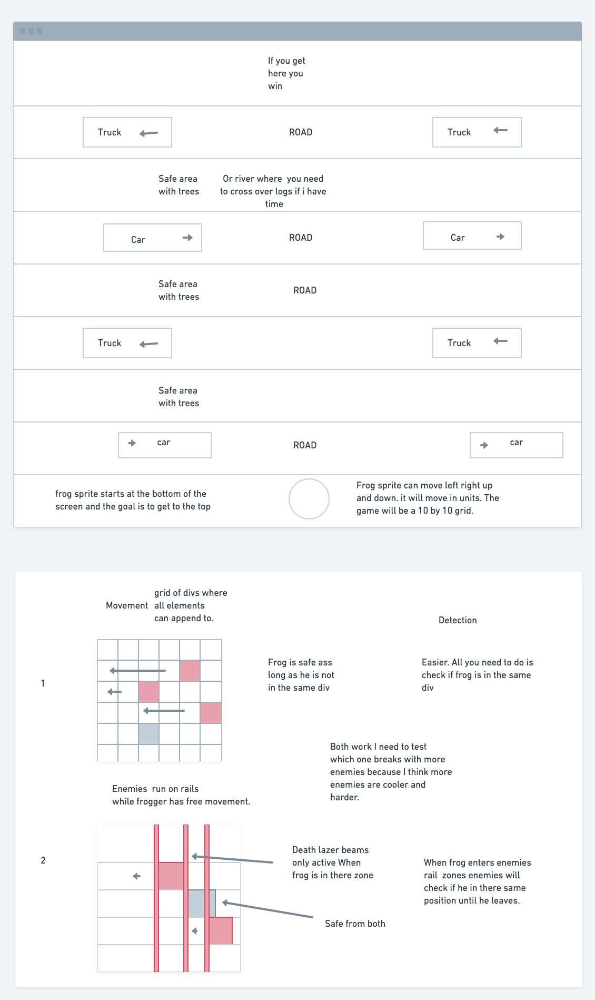
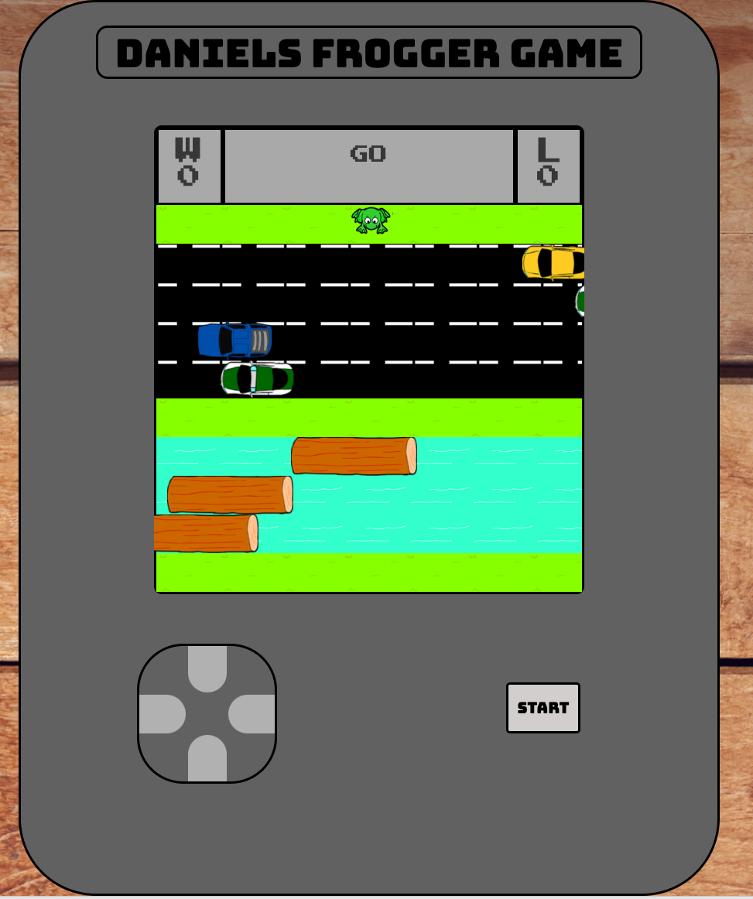
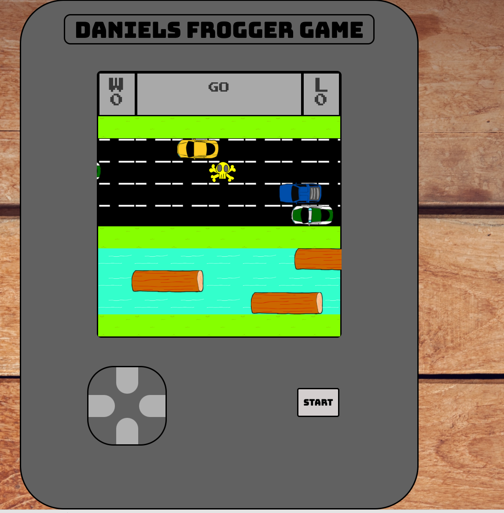
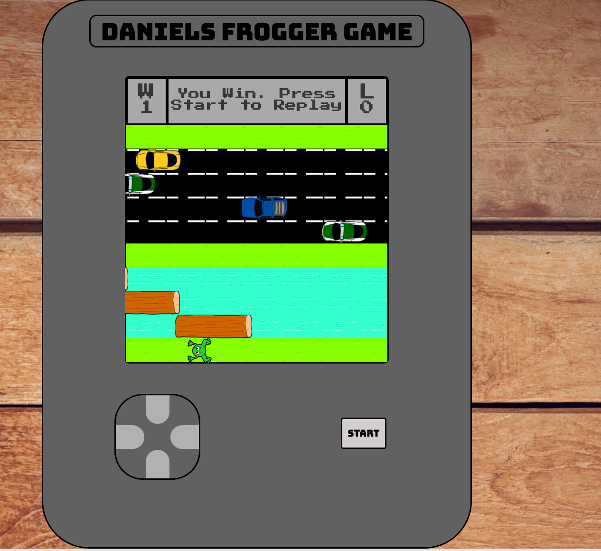
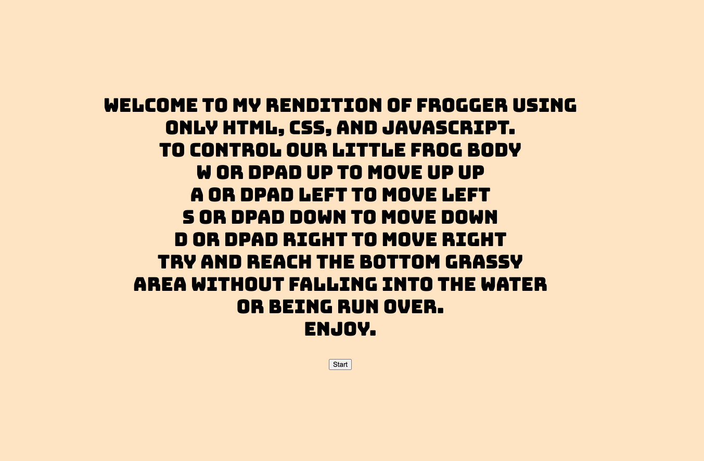

<h1>FroggerJSStyle</h1>

This is an ode to the classic frogger arcade game but redone in js.
the point of my game is to get the frog to the bottom of the map without 
getting squished by a car or falling into the water.

The original wireframe had the frog going down to up but in practice movement was
better going up to down as far as my starting values.

 
frog detection works like the second version where if the frog is in the div height 
of a car or tree it will then check if he is in the object.
The frog starts from bottom to top will be killed if he hits a car or jumps in the water,
and wins if he makes it to the bottom

 
<h2>Technologies Used</h2>
<h3>HTML</h3>
<h3>CSS</h3>
<h3>JAVASCRIPT</h3>
 
<h2>Getting Started</h2>
<h3>The intro screen tells you how to play</h3>
<h4>w or dPad up moves frog up</h2>
<h4>a or dPad left moves frog left</h4>
<h4>s or dPad down moves frog down</h4>
<h4>d or dPad right moves frog right</h4>

click below to play
https://diggy63.github.io/FroggerJSStyle/

<h2>Future Goals</h2>
The ultimate goal is for the map to randomize every level or start of the game making the levels harder as you beat them. So first level 2 roads, 2 cars, and 1 river. Then maybe after you win 4 times you get 3 roads, 4 cars, 2 river and so on.

